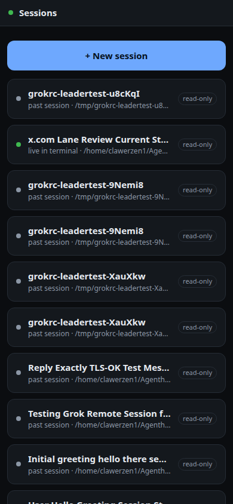
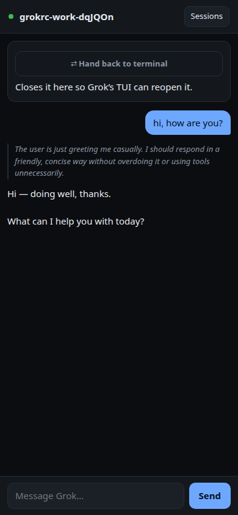
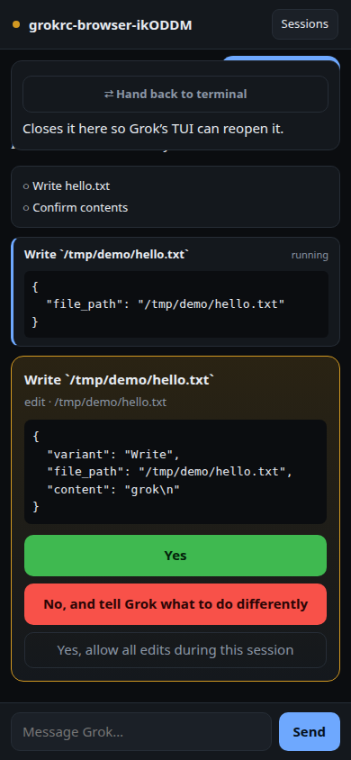

<p align="center">
  
  &nbsp;
  
  &nbsp;
  
</p>

<h1 align="center">grokrc</h1>

<p align="center">
  <b>Remote control for xAI Grok Build.</b><br>
  Drive your coding agent from your phone — over ACP, not a screen scrape.
</p>

<p align="center">
  <a href="#-features">Features</a> ·
  <a href="#-install">Install</a> ·
  <a href="#-quickstart">Quickstart</a> ·
  <a href="docs/GUIDE.md">Guide</a> ·
  <a href="docs/ARCHITECTURE.md">Architecture</a>

</p>

<p align="center">
  <a href="https://github.com/sandeep-alluru/grokrc/actions/workflows/ci.yml"></a>
  <a href="LICENSE"></a>
  
  <a href="https://www.npmjs.com/package/grokrc"></a>
</p>

---

## ⚡ Get started

```bash
# 1. Grok Build (required)
curl -fsSL https://x.ai/cli/install.sh | bash
grok login

# 2. grokrc
npm install -g grokrc

# 3. One required setting — where new sessions open
grokrc config set defaultCwd ~/code

# 4. Approvals must be on (Grok defaults them off)
#    ~/.grok/config.toml
#    [features]
#    support_permission = true
#    [ui]
#    permission_mode = "default"

# 5. Start
grokrc up --lan
```

Open the printed URL on your phone, enter the 6-character code, add to Home Screen.

```
  grokrc listening on http://192.168.1.24:4319

  No paired devices. Open the URL above and enter:

      Y8M8GF
```

Check the install anytime: `grokrc doctor`

---

## ⭐ Features

| | Existing tools | grokrc |
|---|---|---|
| Transport | PTY / terminal bytes | **ACP JSON-RPC** (typed) |
| Waiting for you? | Regex over ANSI | `session/request_permission` |
| Approve a tool | Send keystrokes | One tap by `optionId` |
| Networking | Open inbound ports | LAN, Tailscale, or **outbound relay** |
| Terminal + phone | Separate sessions | **Same session** (`grokrc term`) |
| Take over a TUI session | ✗ | One tap from the phone |
| Hand back to desktop | ✗ | Auto-open terminal + `grok -r` |
| Platforms | Often iOS-only | **PWA** — iOS and Android |
| Grok Build | Unsupported | **Native** |

- **Owned sessions** — start from the phone; full control  
- **Observed sessions** — watch a hand-started `grok` TUI (read-only until take over)  
- **Push notifications** — self-hosted Web Push (VAPID); no third-party cloud  
- **Relay mode** — daemon dials out; nothing listens on your machine  

Full usage: **[docs/GUIDE.md](docs/GUIDE.md)**

---

## 📥 Install

Requires **Node 20+** and [Grok Build](https://docs.x.ai/build/overview).

```bash
npm install -g grokrc
```

From source:

```bash
git clone https://github.com/sandeep-alluru/grokrc.git
cd grokrc
npm install && npm run build
npm link
```

| Platform | Packaged CLI | Full suite (CI) | Service |
|---|---|---|---|
| **Linux** | Node 20–24 | Node 22, 24 | systemd user unit |
| **macOS** | Node 20–24 | Node 22, 24 | — |
| **Windows** | Node 20–24 | Node 22, 24 | Scheduled Task |

Verified against Grok Build `0.2.x` and `1.0.x`.

---

## 🚀 Quickstart

```bash
grokrc config set defaultCwd ~/code   # required
grokrc doctor                         # agent, ACP, approvals
grokrc up --lan                       # reachable on your LAN
```

| Goal | Command |
|---|---|
| Pair another device | `grokrc pair` |
| List devices | `grokrc devices` |
| Revoke a device | `grokrc revoke <id>` |
| Terminal on same session | `grokrc term` |
| Run as a service (Linux) | see [Guide → Service](docs/GUIDE.md#run-as-a-service) |
| Outbound relay | `grokrc up --relay wss://your-relay` |

---

## 📱 Reach your phone

1. **LAN** — `grokrc up --lan` (trusted network only)  
2. **Tailscale** — serve HTTPS to your tailnet (recommended for iOS push)  
3. **Relay** — daemon dials **out**; phone joins the same room over WSS  

Details: [Guide → Networking](docs/GUIDE.md#networking)

---

## 📚 Documentation

| Doc | Contents |
|---|---|
| **[Guide](docs/GUIDE.md)** | Install, config, daily use, push, relay, service, troubleshooting, FAQ |
| **[Architecture](docs/ARCHITECTURE.md)** | Topology, ACP, session modes, event model |
| **[Security](SECURITY.md)** | Threat model, reporting |
| **[Contributing](CONTRIBUTING.md)** | Dev setup, tests, PRs |
| **[Changelog](CHANGELOG.md)** | Release notes |

---

## 🔒 Security in one line

Remote control of a coding agent **is** remote code execution. Pair devices, prefer Tailscale or relay over open LAN, and keep Grok permission prompts **on**. See [SECURITY.md](SECURITY.md).

---

## License

[MIT](LICENSE)
