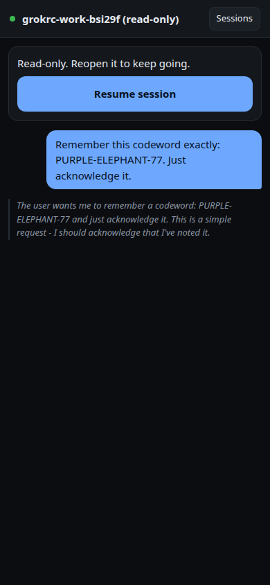
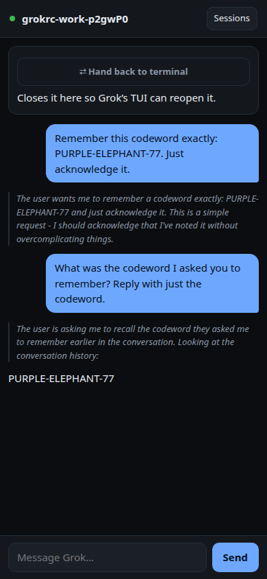
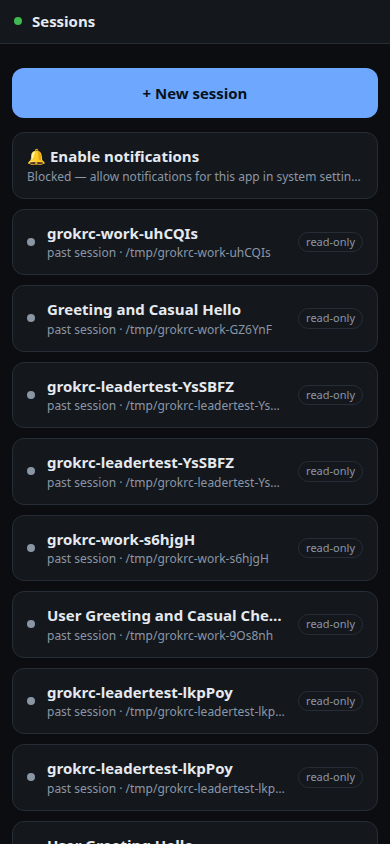

# grokrc — User Guide

How to actually use grokrc day to day.

This assumes the daemon is installed and your phone is paired. If not, start with
[SETUP.md](../SETUP.md) — installation, configuration, and networking live there. This
guide covers what to do once it works.

---

## Contents

1. [The mental model](#1-the-mental-model)
2. [The session list](#2-the-session-list)
3. [Session modes — owned, shared, observed](#3-session-modes--owned-shared-observed)
4. [Driving a turn](#4-driving-a-turn)
5. [Approvals](#5-approvals)
6. [Reading the transcript](#6-reading-the-transcript)
7. [Resuming a past session](#7-resuming-a-past-session)
8. [Watching a session you started in the terminal](#8-watching-a-session-you-started-in-the-terminal)
9. [The terminal client](#9-the-terminal-client)
10. [Notifications](#10-notifications)
11. [Working away from your network](#11-working-away-from-your-network)
12. [Managing devices](#12-managing-devices)
13. [Command reference](#13-command-reference)
14. [Habits that make this pleasant](#14-habits-that-make-this-pleasant)

---

## 1. The mental model

There are three pieces. Keeping them straight explains almost every question people ask.

```
   ┌─────────┐        ┌──────────────┐       ┌───────────────┐
   │  phone  │◄──────►│   grokrc     │◄─────►│  grok agent   │
   │  (PWA)  │   ws   │   daemon     │  ACP  │    stdio      │
   └─────────┘        └──────────────┘       └───────────────┘
                             ▲
                             │ ws
                      ┌──────┴──────┐
                      │ grokrc term │
                      └─────────────┘
```

- **The daemon owns the agent.** It spawns `grok agent stdio` and speaks
  [ACP](https://agentclientprotocol.com) to it. Sessions live and die with the daemon,
  not with your phone.
- **Clients are views.** Your phone, a second phone, and `grokrc term` are all just
  clients. Closing one does not stop the work.
- **The phone is not a terminal.** grokrc does not stream terminal bytes. Tool calls,
  plans, and permission requests arrive as structured JSON and are rendered as UI. That
  is why an approval is a real button and not a keystroke you hope lands.

**Consequence worth internalising:** if you lock your phone mid-turn, the agent keeps
working. Reopen and you get the full transcript, not a truncated one.

---

## 2. The session list

The first screen after pairing. Each row is a session:


| Element               | Meaning                                                          |
| --------------------- | ---------------------------------------------------------------- |
| **New session**       | Starts a fresh agent in your configured `defaultCwd`             |
| Green dot             | Live — you can talk to it                                        |
| Amber dot + `waiting` | The agent is blocked on an approval. Open it.                    |
| No dot                | A past session on disk. Read-only until you resume it.           |
| `live in terminal`    | Started outside grokrc and currently running — observed          |
| `past session · path` | Finished; the working directory it ran in                        |
| Dashed row            | A notice, not a session — currently only the notifications prompt |

The dot in the top-left corner of the screen is the **connection** indicator: green
means the socket is live, red means reconnecting. It reconnects on its own with
backoff; you do not need to reload.

---

## 3. Session modes — owned, shared, observed

This is the single most useful concept in grokrc.

| Mode         | Created by                             | Can you prompt it?      | How it works                            |
| ------------ | -------------------------------------- | ----------------------- | --------------------------------------- |
| **owned**    | grokrc (`New session`, `grokrc term --new`) | **Yes**             | The daemon spawned the agent            |
| **shared**   | grokrc with `--leader`                 | **Yes**                 | Several clients on one backend          |
| **observed** | you, in a terminal (`grok`)            | **No** — read-only      | Tails Grok's own `updates.jsonl` log    |

**Why observed sessions are read-only:** the daemon did not spawn that agent, so it has
no ACP channel to it — only Grok's log file. It can show you everything happening; it
cannot inject a prompt.

**If you want to take over an observed session**, resume it (section 7). That closes the
read-only view and starts an owned session carrying the same history.

---

## 4. Driving a turn

Open a session, type in the composer, tap **Send**.


While the agent works:

- The Send button becomes **Stop**. Tapping it cancels the turn.
- Thinking appears in a collapsed grey block. It is capped in height so a long chain of
  reasoning cannot bury the answer.
- Tool calls appear as cards that update in place — pending → running → ok/failed.
- The composer stays usable. Anything you send while offline is queued and delivered on
  reconnect rather than silently dropped.

**Cancelling** stops the current turn. It does not close the session — the history is
intact and you can prompt again immediately.

**Closing** a session (from the session view) shuts the agent down. The transcript
remains on disk and can be resumed later.

---

## 5. Approvals

This is the reason grokrc exists in the shape it does.

When Grok wants to write a file, run a command, or take any action requiring permission,
it sends `session/request_permission` with real options. grokrc renders them as buttons:


```
  Write hello.txt
  edit · /tmp/demo/hello.txt

  { "variant": "Write", "file_path": "...", "content": "grok\n" }

  [ Yes ]  [ Yes, allow all edits during this session ]  [ No, and tell Grok what to do differently ]
```

- Buttons come from the agent, not from grokrc. The wording is Grok's.
- Tapping answers with the option's `optionId` — no keystroke simulation, no guessing.
- Buttons disable immediately so a double-tap cannot answer twice.
- Answered requests stay in the transcript, marked resolved, so you can see what you
  approved.

### If you never see approval buttons

Grok ships with permission prompting **off**. Check:

```bash
grokrc doctor
```

If it reports `✗ agent will NOT prompt — remote approval is inoperative`, fix
`~/.grok/config.toml`:

```toml
[features]
support_permission = true

[ui]
permission_mode = "default"   # "auto" suppresses prompts even when the above is true
```

Restart the daemon. **This matters beyond grokrc:** with prompting off, the agent acts
without asking anyone, including in your terminal.

---

## 6. Reading the transcript

| Element              | What it is                                                       |
| -------------------- | ---------------------------------------------------------------- |
| Right-aligned bubble | Your prompt                                                      |
| Left-aligned text    | The agent's reply, streamed                                      |
| Grey collapsed block | Reasoning. Height-capped; scroll inside it.                      |
| Card with a title    | A tool call. Shows the tool, the target path, and the arguments. |
| Green/red card edge  | Tool succeeded / failed                                          |
| Numbered checklist   | The agent's plan, updated in place as steps complete             |
| Red text             | An error from the daemon or the agent                            |

Tool arguments are rendered as readable JSON. If you ever see a raw byte array, that is
a bug worth reporting.

---

## 7. Resuming a past session

Sessions on disk are read-only until resumed. Open one and you get a bar at the top:



Tap **Resume**. The daemon calls ACP `session/load`, which replays the conversation into
a fresh agent process. The agent remembers what happened — this is verified in
`tools/resume-check.mjs`, which plants a codeword before closing a session and asserts
the agent recalls it afterwards.



**When Resume fails**, you get the reason rather than a spinner:



Common causes:

- The working directory no longer exists or was moved.
- You are at the 12-session live cap. Close something first.
- The session is currently live in a terminal — it says `live in terminal`, and you
  cannot take it over while the other process holds it. Stop it there first.

---

## 8. Watching a session you started in the terminal

Start Grok normally:

```bash
cd ~/code/my-project
grok
```

Within a second or two it appears in the phone's list as `live in terminal`. Open it and
you see the conversation as it happens — prompts, reasoning, tool calls, results — all
read-only.

This works because Grok writes `updates.jsonl` per session and grokrc tails it. It is
independent of ACP, which is why it works for sessions grokrc never started.

### Taking it over from your phone

Open the session and tap **Take over**. It asks twice — this stops a process on a
machine you cannot see — then it terminates the terminal's `grok` and resumes the
session here with its full history.

The conversation is kept. Everything the terminal did is still there, and everything you
do next is there when you go back.

**What it will not do:** kill anything that is not Grok. Grok's registry can name a pid
that has died and been recycled by the OS onto an unrelated program, so the daemon reads
the process's `argv[0]` and refuses unless it is actually `grok`. It sends `SIGTERM`
only — never `SIGKILL`, which risks losing the last message.

### Giving it back

Two ways, and the first is usually what you want:

```bash
grokrc term --session <id>      # no handback at all — both drive it at once
```

Once the daemon owns a session, your terminal and your phone are both clients of it.
There is nothing to hand back.

If you specifically want **Grok's own TUI** again, tap **⇄ Hand back to terminal**. The
daemon closes the session — it has to let go, or two agents end up on one conversation —
and shows you the exact command:

```bash
cd /path/to/project && grok -r <session-id>
```

Verified round trip with real Grok: a codeword planted in the TUI, a second planted by
the daemon after takeover, and `grok -r` recalled both.

> **Grok's TUI cannot join a shared grokrc backend.** This was verified four ways: the
> TUI never connects to `leader.sock`, `use_leader` appears zero times in Grok's README,
> `grok inspect` surfaces no leader config, and `grok --help` has no `--leader`. Take
> over and hand back exist because joining is impossible — `grokrc term` avoids the
> problem entirely by not using the TUI.

> **A terminal sitting at the prompt is invisible here.** Grok registers a session in
> `active_sessions.json` only once a conversation exists, so a freshly launched `grok`
> with nothing typed into it will not appear in the list at all.

---

## 9. The terminal client

`grokrc term` connects to the **daemon**, so your terminal and your phone are looking at
the same session.

```bash
grokrc term                    # attach to an existing session (pick from a list)
grokrc term --new              # start a new one
grokrc term --session <id>     # attach to a specific session
grokrc term --url ws://host:4319
```

Type to prompt. Approvals appear as a numbered choice. Type the number.

This is the answer to "how do I hand off between laptop and phone" — start it in
`grokrc term`, walk away, pick it up on the phone mid-turn.

---

## 10. Notifications

Notifications tell you when a turn finishes or the agent is blocked on an approval. They
are optional; everything else works without them.

### On Android

Android is the easy case: Chrome supports Web Push in an ordinary tab, with no
home-screen requirement and no browser restriction.

1. Open the URL in **Chrome** (Firefox and Edge also support Web Push; Samsung
   Internet does too).
2. Tap **🔔 Enable notifications** at the top of the session list.
3. Accept Chrome's permission prompt.

That is the whole flow. If the row does not appear, it will say why — see
[Notifications never arrive](TROUBLESHOOTING.md#notifications-never-arrive)
below.

**Install it to the home screen (optional, recommended).** Chrome menu **⋮ → Add to
Home screen** (newer builds say **Install app**). This gives a standalone window with
no address bar, and Android keeps the service worker registered more reliably. Unlike
iOS, notifications work either way.

**HTTPS is still required.** Web Push and service workers need a secure context.
Tailscale or a relay gives you one; a plain `http://` LAN address will not work, and
the notification row will tell you so rather than failing silently.

**Battery optimisation.** If notifications arrive late or stop after a while, Android
may be sleeping Chrome in the background: **Settings → Apps → Chrome → Battery →
Unrestricted**. This is an OS-level power setting, not something the app controls.

> **Support status.** The Android path uses the same standard Web Push flow this
> daemon already serves to desktop Firefox, but it has **not been tested on a
> physical Android device**. Nothing here is known to be broken; it is untested,
> which is not the same as verified.
>
> To confirm delivery on your own device, run `grokrc doctor` — it reports the
> daemon's push counters, and `sent` increases by one each time a turn finishes.

### On desktop

Chrome, Firefox and Edge all support Web Push in a normal tab. Same flow: open the
app, tap **🔔 Enable notifications**, accept the prompt. Safari on macOS requires the
site to be added to the Dock (**File → Add to Dock**), the desktop equivalent of the
iPhone dance below.

### On iPhone — read this, it is genuinely awkward

Apple only permits Web Push in a **home-screen app installed from Safari**. Specifically:

- **Safari is required.** Chrome, Firefox, DuckDuckGo, Brave, Edge on iOS **cannot do
  push at all.** They run on WebKit without the capability. There is no setting.
- **The page must be added to the Home Screen**, and opened from that icon. A Safari
  tab — even the same URL — has no push support.
- **HTTPS is required.** Tailscale or a relay gives you this; plain `http://` will not
  work.

Steps:

1. Open **Safari** and load your grokrc URL.
2. Tap **Share** — the square with an arrow pointing up, in the bar at the bottom of the
   screen, between the forward arrow and the bookmarks icon.
3. Scroll the panel down to **Add to Home Screen** → **Add**.
4. Leave Safari. Tap the new **grokrc** icon.
5. It should open with **no address bar** — that is how you know you are in the app and
   not a tab.
6. Tap **🔔 Enable notifications** → **Allow**.

If push cannot work from where you are, the row says so and names the reason rather than
disappearing. Whatever it reports is the actual state.

### Checking it worked

```bash
grokrc doctor
#   · push: 2 subscriber(s), 14 sent, 0 failed, 0 expired
```

Subscriptions that return 404/410 are pruned automatically. Other failures are counted
and reported but not pruned — a transient outage should not unsubscribe your phone.

---

## 11. Working away from your network

Three options, in order of how much they ask of you.

### Tailscale — recommended

```bash
tailscale serve --bg 4319
```

Real HTTPS, tailnet-scoped, nothing exposed publicly. Your phone needs the Tailscale app
and needs to be connected. This is what the author uses.

### Relay — nothing listening at all

The daemon dials **out** to a relay, so no inbound port exists on your machine. Works on
cellular, behind CGNAT, on hotel Wi-Fi.

```bash
# on a VPS
grokrc relay --port 8080

# on your machine
grokrc up --relay https://relay.example.com
```

It prints a URL containing a room, a key, and — in the **fragment** — an encryption
secret. Browsers never transmit the fragment to a server, so the relay routes traffic it
cannot read. Everything is AES-256-GCM end-to-end between your phone and your daemon.

**Treat that URL as a credential.** Anyone who has it has your session.

### `--lan`

```bash
grokrc up --lan
```

Fine at home, on a network you trust. Pairing is still required, but traffic is plain
HTTP — do not do this on café Wi-Fi.

---

## 12. Managing devices

```bash
grokrc devices              # list paired devices, with last-seen times
grokrc revoke <id>          # revoke one
grokrc revoke --all         # revoke everything, then re-pair
```

`grokrc devices` marks who is connected **right now** — `●` connected, `○` paired but
absent. That state exists only in the running daemon, so without one the column is blank
and the listing falls back to the store on disk.

Lost your phone? `grokrc revoke <id>`. The token stops working and, if that device is
connected, its socket is closed immediately rather than at its next reconnect.

To add a device, ask the running daemon for a code:

```bash
grokrc pair
#
#   Enter this on the device you are pairing:
#
#       Z37D8U
#
#   (valid 5 minutes, single use)
```

Codes are 6 characters, valid 5 minutes, single use. **No restart required** — the CLI
reaches the daemon over a Unix socket at `~/.grokrc/control.sock`, so the code is minted
by the process that will actually redeem it.

`grokrc up --pair` still prints one at startup, which is convenient for the first device.

With no daemon running, `grokrc pair` says so rather than printing a code nothing could
redeem.

---

## 13. Command reference

```
grokrc up          Start the daemon and serve the phone client
    --port <N>       Port (default 4319)
    --host <H>       Bind address (default 127.0.0.1 — loopback only)
    --lan            Bind 0.0.0.0 so other devices on your network can reach it
    --leader         Share one backend with a running grok TUI
    --model <M>      Model override for new sessions
    --cwd <DIR>      Default working directory for new sessions
    --pair           Print a pairing code even if devices are already paired
    --history <N>    How many past sessions to list (default 10)
    --relay <URL>    Dial OUT to a relay — no inbound port, works on cellular
    --room <ID>      Relay room id (generated if omitted)
    --relay-key <K>  Relay room key (generated if omitted)

grokrc relay       Run a self-hostable relay server
    --port <N>       Port (default 8080)

grokrc term        Terminal client on the same session your phone drives
    --new            Start a new session
    --session <id>   Open a specific session
    --url <URL>      Daemon URL (default ws://127.0.0.1:4319)

grokrc pair        Print a pairing code for a new device
grokrc config      Show settings · config set <key> <value> · config unset <key>
grokrc devices     List paired devices
grokrc revoke <id> Revoke a device (--all to revoke everything)
grokrc doctor      Check that grok is installed and ACP responds
```

### Settings

Stored in `~/.grokrc/config.json`.

```bash
grokrc config                                  # show current values
grokrc config set defaultCwd ~/code            # where new sessions start
grokrc config set lan true                     # bind 0.0.0.0 by default
grokrc config unset defaultCwd
```

`defaultCwd` has **no default on purpose** — grokrc will not guess where to run an agent
that can modify files. Set it before creating sessions from the phone.

---

## 14. Habits that make this pleasant

- **Turn approvals on.** Without them the agent runs unattended and grokrc's best
  feature does nothing. `grokrc doctor` tells you.
- **Set `defaultCwd` to a directory you are happy for an agent to modify.** Not `~`.
- **Use Tailscale rather than `--lan`** the moment you leave your own network.
- **Close sessions you are done with.** The live cap is 12, and hitting it during a
  resume is annoying.
- **Run it as a service** so it survives reboots — see
  [SETUP.md §7](../SETUP.md#7-run-it-as-a-service).
- **Revoke devices you no longer use.** `grokrc devices` shows last-seen times.

---

## See also

- [SETUP.md](../SETUP.md) — installation, configuration, networking
- [TROUBLESHOOTING.md](TROUBLESHOOTING.md) — when something does not work
- [FAQ.md](FAQ.md) — short answers
- [01-architecture.md](01-architecture.md) — how it works internally
- [../SECURITY.md](../SECURITY.md) — threat model
